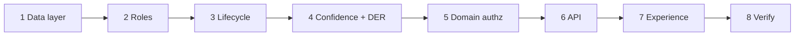

# Implementation Plan

Ordered so that each stage is independently testable and nothing depends on a stage that
has not yet been proven. P0 first, as the directive requires.

---

## Stage 1 — Data layer (closes P0-1, P0-3, P0-5, P0-6, P1-1, P1-4, P1-5)

**Migration `0013_decision_intelligence.sql`**

| Table | Purpose | Key constraints |
|---|---|---|
| `domains` | The authorization boundary the audit found missing | unique `(tenant_id, slug)` |
| `team_members` | Domain membership | unique `(tenant_id, domain_id, user_id)` |
| `decisions` | The decision case | `state` CHECK against the 11 states; `domain_id` NOT NULL |
| `decision_options` | Options under consideration | score, cost, risk, reversibility |
| `recommendations` | The recommended option + calculated confidence | `confidence` nullable; `calculation` NOT NULL when confidence is not null |
| `decision_evidence` | Evidence cited, with authority and recency | source kind, authority weight, observed-at |
| `decision_transitions` | Append-only transition log | trigger refuses UPDATE/DELETE/TRUNCATE |
| `actions` | Governed business action | reversible flag, executor, result |
| `decision_outcomes` | Measured result vs target | verification method, verifier, verified-at |
| `lessons_learned` | What the organisation learned | linked to decision |
| `kpi_definitions` | Formula, unit, direction, target, owner | unique `(tenant_id, key)` |
| `kpi_values` | Measured value in a period | FK to definition, NOT NULL |
| `notifications` | Recipient inbox | recipient, kind, read state |
| `policy_results` | Persisted policy evaluation | linked to decision |

All under `FORCE ROW LEVEL SECURITY` with the `app.tenant_id` predicate and the same
grant pattern as migration `0008`.

**Proof:** a test asserting every new table has RLS forced and is invisible from an
unbound session; a test asserting `decision_transitions` refuses UPDATE and DELETE even
as owner.

## Stage 2 — Roles (closes P0-7)

Add `engineer`, `section_lead`, `department_manager` to `SYSTEM_ROLES` with distinct
permission sets and autonomy ceilings, plus the `decisions:*`, `kpis:*` and
`notifications:read` permissions in the catalogue.

**Proof:** a test asserting the three new roles exist, have distinct permission sets, and
that a `section_lead` cannot hold `approvals:decide` above their authority.

## Stage 3 — Lifecycle engine (closes P0-2)

`agentic_os/decisions/lifecycle.py`:
- `LEGAL_TRANSITIONS: dict[State, frozenset[State]]` — the graph from the architecture.
- `transition(session, ctx, decision_id, to_state, reason)` — the **only** writer of
  `decisions.state`. Authorizes, checks legality, writes the row, appends the transition,
  writes the audit ledger entry, generates notifications.

**Proof:** a test per legal transition; a test that every illegal pair raises; a
source-level test asserting no other module writes `decisions.state`.

## Stage 4 — Confidence and effectiveness (closes P0-4)

`agentic_os/decisions/confidence.py` and `effectiveness.py`, exactly as specified in the
architecture.

**Proof:** a test that zero evidence yields `None`; a test that a single option yields
`None`; a test that a stored confidence always has a reconstructable calculation; a test
that DER over an empty set is `None`, not 0.0 and not 1.0.

## Stage 5 — Domain authorization (closes P0-5's enforcement half)

Domain membership added to the read predicate for decisions, **inside the SQL**.

**Proof:** the target the directive names — a user in domain A querying a decision in
domain B receives zero rows and a 404. Asserted at the repository level (the query
returns nothing) and at the API level (the response is 404, not 403).

## Stage 6 — API (`/v1/decisions`, `/v1/kpis`, `/v1/notifications`)

Every route with `Depends(require_permission(...))`, matching the existing pattern. Read
routes, a create route, a transition route, an option route, an evidence route, an
outcome route.

**Proof:** a test per route asserting an unauthorized caller is refused; a test asserting
the transition route rejects an illegal transition with a 4xx.

## Stage 7 — Experience layers (closes P1-3, P2-2, P2-8)

- `/decisions` — Decision Queue, filtered by the caller's domains and role.
- `/decisions/[id]` — the case: context, options, recommendation with calculated
  confidence or "Not Calculated", evidence, transitions, outcome.
- `/` — Executive Command reworked to lead with decisions and effectiveness; platform
  health demoted to a secondary panel.
- `/notifications` — inbox.
- Empty states differentiated between "no data" and "not permitted".
- Every new string in both `EN` and `AR` — the catalogue fails the build otherwise.

**Proof:** the console builds; axe passes; the i18n guard passes; RTL guard passes.

## Stage 8 — Verification

1. Full test suite against real PostgreSQL and Redis with `AGENTIC_REQUIRE_SERVICES`
   set, so an absent service fails rather than skips.
2. Runtime verification: migrate, seed, start the API, exercise a complete decision
   through all eight loop stages against the live stack, and record the observed output.
3. Load test asserting API p95 on the decision endpoints (P2-1).
4. `SECURITY_REVIEW.md` and `FINAL_READINESS_REPORT.md`.

---

## Sequencing

Strictly sequential: each stage's proof depends on the previous stage existing. No stage
is marked done without its stated proof passing.

## Out of scope, and why

Everything in P3 of the gap analysis: seven outbound integrations
(`EXTERNAL_DEPENDENCY`), DR verification (`PRODUCTION_CONFIGURATION_REQUIRED`),
penetration test (`EXTERNAL_DEPENDENCY`), Arabic body translation (`BLOCKED` on a native
reviewer), multi-region, screen reader verification (`EXTERNAL_DEPENDENCY`), model drift
detection. These will appear in the final report with those markers rather than being
omitted.
