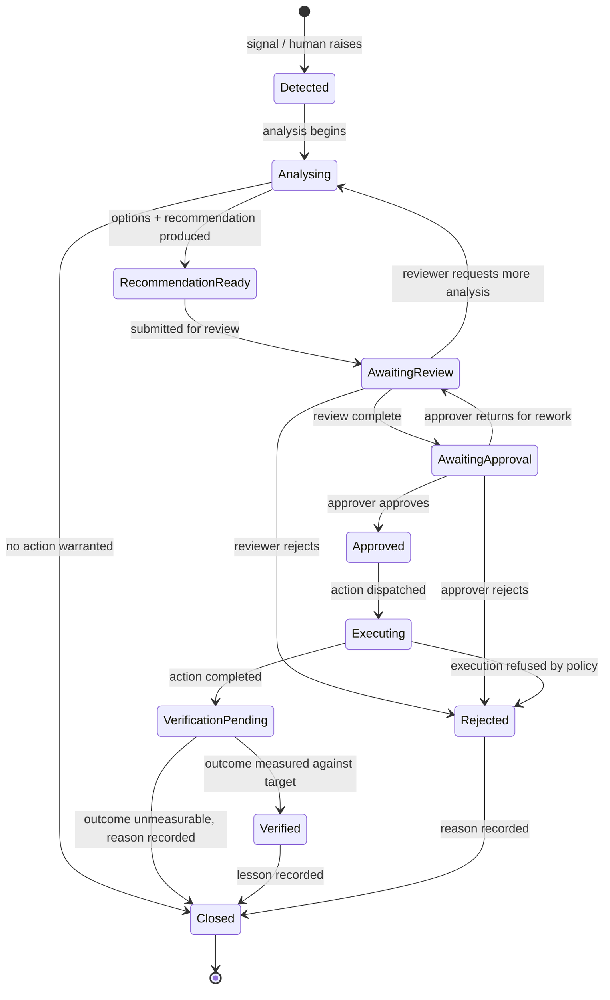
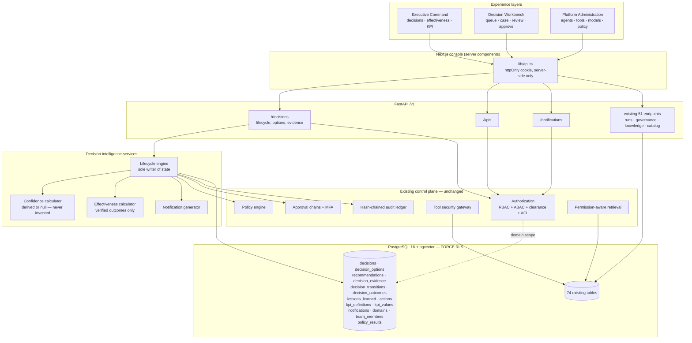
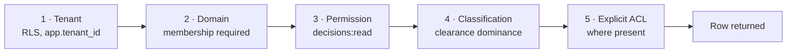
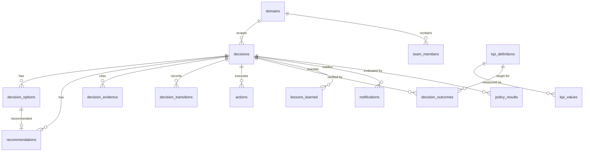

# Target Architecture

**Principle:** extend, do not replace. Every element the audit marked load-bearing stays
exactly where it is. The decision intelligence layer is added *above* the existing
control plane and *reuses* its authorization, audit and policy machinery rather than
duplicating it.

---

## 1. The operating loop as a first-class object



The eight loop stages map onto the eleven states:

| Loop stage | State(s) | Actor |
|---|---|---|
| DETECT | `Detected` | signal, or a human raising a case |
| ANALYSE | `Analysing` | agent, governed by the existing control plane |
| RECOMMEND | `RecommendationReady` | agent produces options + a recommendation with calculated confidence |
| REVIEW | `AwaitingReview` | Section Lead / Department Manager |
| APPROVE | `AwaitingApproval` → `Approved` / `Rejected` | Approver, MFA step-up |
| EXECUTE | `Executing` | existing tool gateway — never the conductor directly |
| VERIFY | `VerificationPending` → `Verified` | measured against a KPI target |
| LEARN | `Closed` + `lessons_learned` | recorded, feeds future analysis |

**The state column has exactly one writer.** `decision_service.transition()` is the only
code permitted to write `decisions.state`; a database trigger appends to
`decision_transitions` on every change, and that table is append-only in the same manner
as the audit ledger.

---

## 2. System architecture



**Reuse, explicitly:** the decision layer creates no new authorization mechanism, no new
audit mechanism and no new approval mechanism. `require_permission` guards every new
route exactly as it guards the existing 51. Every state transition writes to the existing
hash-chained ledger. `Approved` is reached through the existing approval chain with its
existing MFA step-up.

---

## 3. Authorization model — including the new domain axis

A caller may read a decision only when **all** of the following hold. They are evaluated
in this order, and the first four are enforced inside the SQL predicate, not after the
fetch:



**Cross-domain access returns 404, not 403.** A 403 discloses that the resource exists.
The directive requires that a user cannot *discover* content they cannot access, so the
domain predicate is part of the `WHERE` clause and a non-member's query returns zero rows
— indistinguishable from the decision not existing.

---

## 4. Confidence — the calculation, stated

Confidence is never a model's self-report and never a constant. It is computed from four
countable inputs, and the computation is stored with the value and rendered to the user:

| Input | Source | Weight |
|---|---|---:|
| Evidence count | `count(decision_evidence)`, capped at 5 | 0.30 |
| Evidence recency | fraction of evidence newer than 90 days | 0.20 |
| Source authority | mean authority weight of linked sources | 0.25 |
| Option separation | normalised score gap between the top two options | 0.25 |

```
confidence = Σ (input_normalised × weight)
```

**If fewer than two options exist, or zero evidence is linked, the result is `null`** and
every surface renders **"Confidence: Not Calculated"**. There is no default, no floor and
no fallback constant. The stored `calculation` JSON records each input's raw and
normalised value so any figure can be reconstructed and challenged.

---

## 5. Decision Effectiveness Rate — the North Star

```
DER = verified_successful_decisions / decisions_reaching_verification
```

Numerator: decisions in state `Verified` whose linked outcome met its target.
Denominator: decisions that reached `VerificationPending` or beyond.

**When the denominator is zero the API returns `null` and the UI renders "Not
Calculated".** It does not return 0%, which would read as total failure, and it does not
return 100%, which would read as total success. Both are lies about an empty set.

---

## 6. Data model additions



All new tables carry `tenant_id` with `FORCE ROW LEVEL SECURITY` and the same
`app.tenant_id` predicate as the existing 74. `decision_transitions` additionally carries
append-only triggers modelled on the audit ledger's.

---

## 7. Experience layers

| Layer | Route | Primary user | Answers |
|---|---|---|---|
| **Executive Command** | `/` | Executive, Dept Manager | What needs my attention? Are our decisions working? Are we on target? |
| **Decision Workbench** | `/decisions`, `/decisions/[id]` | Engineer, Section Lead, Dept Manager | What is this decision, what are the options, what is the evidence, what do I do? |
| **Platform Administration** | existing `/agents/*`, `/governance/*`, `/security`, `/operations/*` | Platform Admin, Governance, Cyber | Is the platform correct, safe and evidenced? |

The existing 30 routes are **preserved unchanged**. Platform Administration *is* the
existing console; the change is that it stops being the only layer and stops being the
default landing surface for users who are not administrators.

---

## 8. What is explicitly not in this architecture

- No new authentication mechanism.
- No new audit mechanism.
- No client-side state store.
- No microservice split.
- No event bus beyond the existing outbox.
- No AI confidence that is not calculated from stored inputs.
- No integration with an external system this environment cannot reach.
